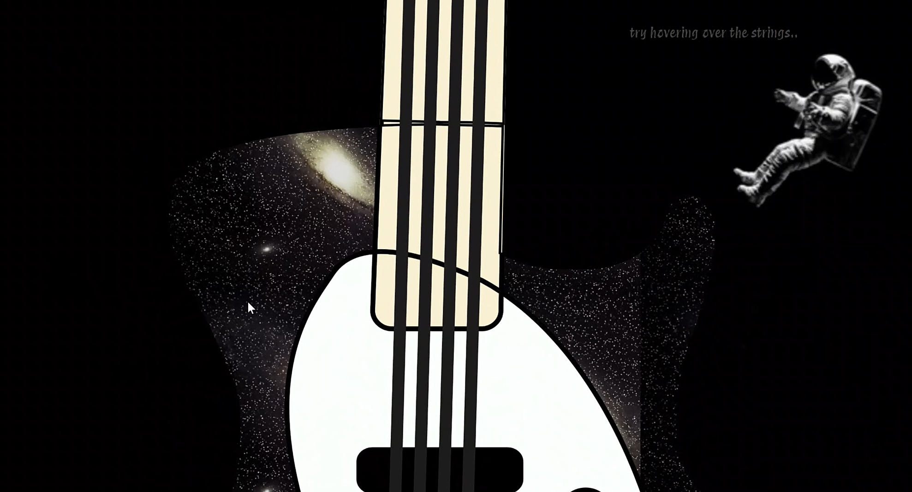
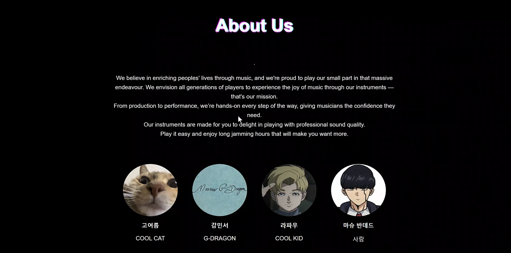

This is my first personal project, a website dedicated to guitars. It features a unique design and interactive elements to engage users. 

## Features

  

### 🖥️ **Technology Stack**
#### This project is built using the following technologies: 

### 🎸 **Interactive Design**
- Hover over guitar strings to see them vibrate and hear their corresponding tones.

### 📄 **Pages**
- **My Page**: Manage user profiles effortlessly.
- **Product List**: Browse a curated list of guitars for sale.
- **Rock Meme Page**: Enjoy a collection of rock-related memes for entertainment.

### 🛠️ **Customizable and Expandable**
- Flexible design to accommodate additional features or customizations in the future.

## Future Plans

---
